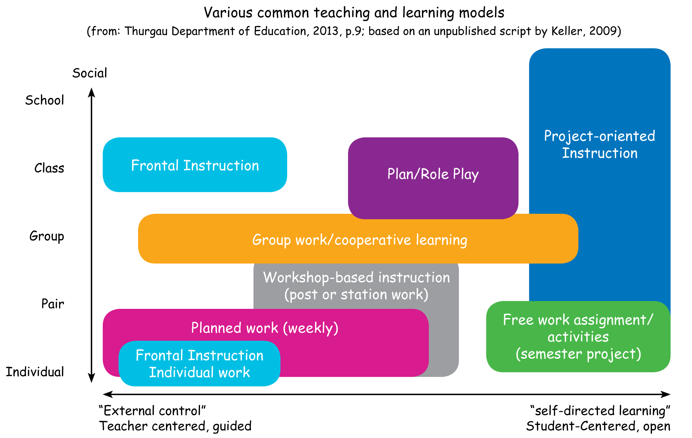

```{r setup, include=FALSE}
knitr::opts_chunk$set(echo = FALSE)
```

---
**General outline:**

* Introduction
* Research Interests
* Teaching Preferences
* Teaching Approach
* Questions 

# Introduction

## Introduction: Overview

**`20` years** of work experience:

* Research: `9` years
* Teaching: `5` years
* Engineering: `9` years

**International** (teaching) experience:

* Russia Federation
* The Netherlands
* Germany

## Introduction: Experiences

* **Teaching:**
    * Mathematics
    * Formal methods
    * Programming languages
    * Data bases
    * Software development
* **Research:**
    * Formal verification
    * Model checking
    * Control systems
    * Machine translation
* **Engineering:**
    * User requirements 
    * Specification and docs.
    * Design and Architecture
    * Testing and development
    * Product ownership

## Introduction: Prog. Languages

Experience in **years**:

* C++ (8)
* Java (7)
* UML (6)
* C (5)
* C# (2)
* SQL (2)
* JavaScript (1)
* Bash (10)
* MATLAB (4)
* Mathematica (1)
* Python (1)
* R (1)
* HTML (2)
* CSS (1)
* OQL (1)

# Research Interests

## Research Interests: Earlier

**Static program analysis:** (BSc, MSc)

* Information stream quality
* Hoare-based verification of C

**Model Checking Markov Chains:** (PhD)

* PCTL, CSL, PRCTL, CSRL
* Numerical and statistical
* Steady-state detection

**Statistical Machine translation:** (PostDoc)

* Distributed Machine Translation Infra.

**Cyber physical systems:** (PostDocs)

* Computable LTL, CTL, CTL* model checking
* Symbolic regression for BDD controllers

## Research Interests: Recent

**Deep learning for control** (PostDoc, `1` BSc, `3` MSc)

* Neural Networks as Correct-By-Design Controllers:
    * Performance
    * Representations
    * Verifiability
* Compact control law representations:
    * Data science models?

**Model driven engineering** (Product Owner, `1` MSc)

* Runtime guarantees by verifying OCL constrains on DMs.

## Research Interests: Future

**Artificial Intelligence:**

* True artificial intelligence
    * Self-motivated
    * Unsupervised learning
* Model checking
    * Design, training, robustness?
* Static program analysis
    * --//--

**Domain specific languages:**

* Evolution of DSL meta models
    * Backwards compatibility
* Designs for DSL implementations 
    * Extendible and maintainable
* Runtime guarantees via static constrains

# Teaching Preferences

## Teaching Preferences: Earlier

**Novosibirsk State University (lecturer):** (2000--2004)

* Introduction to UML
* Unified Modeling Language UML
* Introduction to C# language

**TU Twente (teaching assistant):** (2004--2006)

* Formal Methods for Software Engineering

**RWTH Aachen (teaching assistant):** (2006--2008)

* Advanced Model Checking

## Teaching Preferences: Recent

**Fontys Hogeschool (docent)** (2014--2015)

* $\underline{\text{Discrete Mathematics}}$:
    * Linear Algebra
    * Regular Languages 
    * Grammars and Finite State Automata's
    * Set theory and propositional logic
* $\underline{\text{Software Engineering}}$:
    * C# ASPX .NET
    * Java Enterprise
    * Database Optimizations
    * Operating systems
    * Quality, Testing, and V-Model
    * SQL and Data modeling for RD

# Teaching Approach

## Teaching Approach: Classification

{height=70%}

## Teaching Approach: Literature

An extensive study is presented **in literature**[^6]:

* The ideas should follow logically
* The structure of ideas should be created in class
* Create a comfortable environment
* Use theories like: Social Learning, Constructivism, etc

**Learning can differ greatly** from person to person:

* `5`  different teaching paradigms
* `32` different teaching models between them.

*"The best and maybe the only possible outcome is to try to **determine what** methods or combination of methods a teacher should apply to **suit the biggest percentage in a class**."*

[^6]: "Choosing learning methods suitable for teaching and learning in computer science", Estelle Taylore et al., IADIS, 2013

## Teaching Approach: Me[^7]

**Connect:**

* Be personal
* Use Humor
* Be assertive

**Motivate:**

* Create interest
* Challenge
* Track engagement

**Guide:**

* Define Structure
* Help if needed
* Keep challenging

[^7]: Started on doing BKO at Fontys.

# Questions

## Questions 

**Teaching:**

* What does 80% of teaching include?
* What choices for teaching are there?
* Who creates the lecture materials?
* Teaching/preparation hours per week?

**Research:**

* What does 20% of research include?
* What are the research topic bounds?
* Participation in projects/conferences?
* Supervising BSc. and MSc. students?

**General:**

* Is BKO required and time is given?
* What is to be done during vacations?