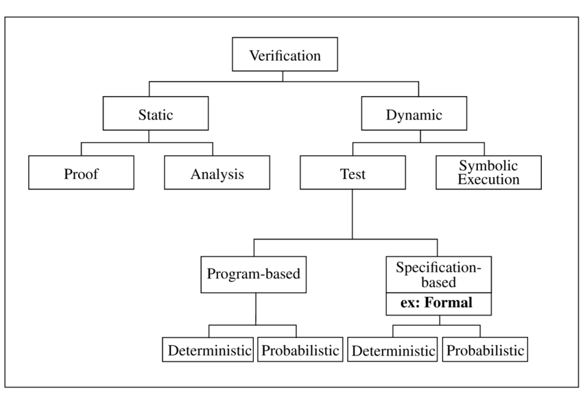
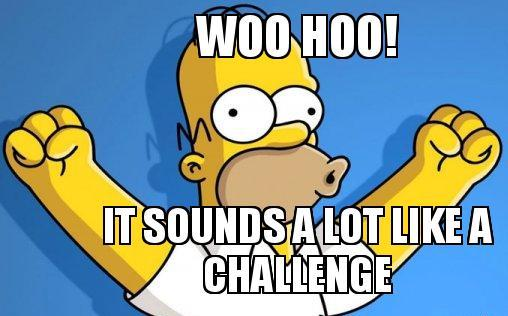

---
**Outline:**

+ Software Quality
    + $\color{gray}{\footnotesize{\text{Motivating Examples}}}$
    + $\color{gray}{\footnotesize{\text{Software Development}}}$
    + $\color{gray}{\footnotesize{\text{Software Verification}}}$
+ Programming Languages
    + $\color{gray}{\footnotesize{\text{Language generations}}}$
    + $\color{gray}{\footnotesize{\text{Declarative vs. Imperative}}}$
    + $\color{gray}{\footnotesize{\text{ANSI-C}}}$
+ Formal Methods
    + $\color{gray}{\footnotesize{\text{Formal Verification}}}$
    + $\color{gray}{\footnotesize{\text{Hoare Approach}}}$
    + $\color{gray}{\footnotesize{\text{Edsger Dijkstra}}}$
+ Frama - C
    + $\color{gray}{\footnotesize{\text{Platform description}}}$
    + $\color{gray}{\footnotesize{\text{Plugins overview}}}$
    + $\color{gray}{\footnotesize{\text{What is ACSL}}}$
+ Verification Examples
+ Concluding remarks

# Software Quality

## Motivating Examples: Major

* `1985`--`1987` -- *Therac-25:*
    * Radiation therapy overdose
    * Control software flaw:
        * Race conditions
    * Death of `6` (six) cancer patients
* `1996`  -- *Ariane-5 missile:*
    * Missile crash
    * Control software flaw:
        * `64`-bit float to `16`-bit int
    * $`7` billion development program
    * $`500` million cargo
* `2005` -- *Toyota Camry:*
    * Sudden unintended acceleration:
    * Control software flaw:
        * Recursion causing stack overflow
    * `89` deaths and `57` injuries
    * $`1.2` billion compensations
    
## Motivating Examples: More

The 12 Software Bugs That Caused Epic Failures:  [$\underline{\color{blue}{\text{<link>}}}$](https://www.testbytes.net/blog/12-software-bugs-that-caused-epic-failure/)

{height=70%}

## Software Development: V-model

{height=70%}

## Software Development: V & V
Is formally defined in, e.g.: [`ISO-9000:2015`](https://www.iso.org/obp/ui/#iso:std:iso:9000:ed-4:v1:en:term:3.8.12):

* **Verification** -- *"Confirmation, through the provision of objective evidence, that specified requirements have been fulfilled."*
* **Validation** -- *"Confirmation, through the provision of objective evidence, that the requirements for a specific intended use or application have been fulfilled."*

## Software Development: Testing

* **Verification**:
    * Are we building the product right?
    * Does the system comply with its specification?
* **Validation**:
    * Are we building the right product?
    * Does the system meet the needs of the customer?

{height=50%}

## Formal Verification

**Facts:**

* No globally recognized definition of Formal Methods[^1].
* Local attempts to have one[^2], e.g.:

> Formal methods are techniques used to model complex systems as mathematical entities. 

>By building a rigorous model of a complex system, it is possible to verify the system's properties in a more thorough fashion than *empirical testing*.

[^1]: "Formal Methods for Industrial Critical Systems", S. Gnesi, T. Margaria
[^2]: ["Formal Methods", Michael Collins, CMU](https://users.ece.cmu.edu/~koopman/des_s99/formal_methods/)

**Conclusion:**

Formal methods are techniques suitable for Verification.

## Software Verification

**Goal:**

A program shall satisfy a formal specification of its behavior.

{height=60%}

# Programming Languages

## Language generations

{height=70%}
  
## Declarative vs. Imperative: Main

* *Declarative* -- Expresses what to accomplish without specifying concrete steps.
```{js, eval=F}
    //Declarative `JavaScript`
    var arr_dbl = arr.map((x) => x * 2)
```
* *Imperative* -- Describes computation in terms of statements that change a program state.
```{js, eval=F}
    //Imperative `JavaScript`
    var arr_dbl = []
    for (let i = 0; i < arr.length; i++) {
      arr_dbl.push(arr[i] * 2)
    }
```

## Declarative vs. Imperative: Test

{height=110%}

## ANSI-C: Just an old C

**Procedural language:**

Is an imperative language in which the program is built from one or more subroutines commonly known as `functions`. 

**`C` language:**

`C` is an *imperative* *procedural* language.

**ANSI-C:**

`ANSI-C` is a common name for two equivalent language specs:

* `C89` by American National Standards Institute (ANSI)
* `C90` by International Organization for Standardization (ISO) 

# Formal Methods

## Formal verification

**Question:** Does formal *validation* exist?

{height=55%}

*Prove* conformance to specifications for *imperative programs*.

## Hoare Approach[^3]

**Hoare triples**: $\left\{P\right\}C\left\{Q\right\}$

$C$ - code; $P$ - pre-condition; $Q$ - post-condition;

**Axioms**, e.g. *Skip* and *Assign*: 
$$\textstyle{\frac{-}{\left\{P\right\} skip \left\{P\right\}}\;\text{and}\;\frac{-}{\left\{P\left[E/V\right]\right\} V := E \left\{P\right\}}}$$
Where $E$ is any expression and $V$ is any variable.

**Inference rules**, e.g. *Composition* and *Conditional*:
$$\textstyle{\frac{\left\{P\right\}S_{1}\left\{R\right\},\;\left\{R\right\}S_{2}\left\{Q\right\}}{\left\{P\right\}S_{1};\;S_{2}\left\{Q\right\}}\;\text{and}\;\frac{\left\{B\wedge P\right\}S\left\{Q\right\},\;\left\{\lnot B\wedge P\right\}T\left\{Q\right\}}{\left\{P\right\}\;\mathbf{if}\;B\;\mathbf{then}\;S\;\mathbf{else}\;T\;\mathbf{elseif}\;\left\{Q\right\}}}$$

**Partial correctness:**
If $P$ holds before executing $C$ then $Q$ holds afterwards, ONLY if $C$ terminates.

[^3]: "An Axiomatic Basis for Computer Programming", Tony Hoare, 1969.

## Edsger Dijkstra[^4]

The *weakest precondition calculus* for 

* A predicate transform semantics to mechanize the proofs.
* Explains how $C$ transforms $P$ into $Q$. 

**Backward reasoning**:

* Based on $Q$ and $C$ calculate the *weakest pre-condition* $\widehat{P}$ 
* If $P \implies \widehat{P}$, then the proof is complete

**Forward reasoning**:

* Based on $P$ and $C$ calculate the *strongest post-condition* $\widehat{Q}$ 
* If $\widehat{Q} \implies Q$, then the proof is complete

[^4]: "Guarded commands, non-determinacy and formal derivation of programs", Edsger Dijkstra, 1975
  
# Frama - C
  
## Platform description

A plug-in-based open-source cross-platform framework for `C` source-code analysis:

* Browsing unfamiliar code
* Static code analysis
* Dynamic code analysis
* Code transformations
* Certification of critical software

You can easily build upon the existing plug-ins to implement your own analysis. 

## Plugins overview: Main


## Plugins overview: WP


## What is ACSL: General

In short:

* ACSL -- ANSI/ISO C Specification Language
* Allows to formally specify properties of a C program

It is all about function contracts:

```{c, eval=F}
  /*@ ensures \result >= x && \result >= y;
      ensures \result == x || \result == y;
   */
  int max (int x, int y) {
    return(x > y) ? x : y;
  }
```

A function contract is a combination of:

* post-conditions - `ensures`
* pre-conditions - `requires`

## What is ACSL: Pointers

ACSL allows to reason about, e.g.:

* Pointers
* Arrays
* Termination

Consider pointers:

```{c, eval=F}
  /*@ requires \valid(p) && \valid(q);
      ensures *p <= *q;
   */
  void max_ptr (int *x, int *y) {
    if(*x >*y) {
      int tmp =*x;
      *x =*y;
      *y = tmp;
    }
  }
```

## What is ACSL: Completeness

Is the following `max_ptr` implementation correct?

```{c, eval=F}
  /*@ requires \valid(p) && \valid(q);
      ensures *p <= *q;
   */
  void max_ptr (int *x, int *y) {
    *p = *q = 0;
  }
```

The is the following specification *complete*?

```{c, eval=F}
  /*@ requires \valid(p) && \valid(q);
      ensures *p <= *q;
      ensures (*p == \old(*p) && *q == \old(*q)) ||
              (*p == \old(*q) && *q == \old(*p));
   */
  void max_ptr(int*p, int*q);
```

## What is ACSL: The spec.

The complete specification *v1.4* has `93` pages:
https://frama-c.com/download/acsl_1.4.pdf

{height=60%}

# Verification Examples
  
# Concluding remarks
  
