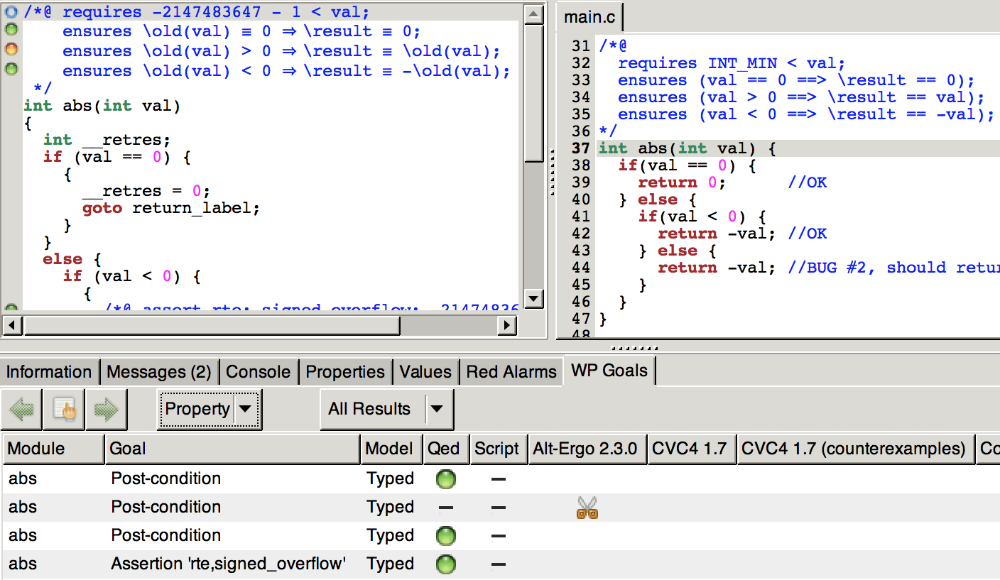

---
**Global Outline:**

+ Software Quality
+ Programming Languages
+ Formal Verification
+ Frama-C Framework
+ Verification Practice
+ Concluding Remarks

# Software Quality

## Software Quality: Outline

* Motivating examples
* Software Development
* Software Verification

## Motivating examples: Therac-25

Years **`1985`--`1987`**: Radiation overdose

* Control software flaw:
    * Race conditions
* Death of `6` (six) cancer patients

{height=70%}


## Motivating examples: Ariane-5
    
Year **`1996`**: Missile crash

* Control software flaw:
    * `64`-bit float to `16`-bit integer conversion
* $`137` million Rocket + $`500` million cargo

{height=45%}

## Motivating examples: Toyota

Year **`2005`**: Sudden unintended acceleration

* Control software flaw:
    * Recursion causing stack overflow
* `89` deaths and `57` injuries
* $`1.2` billion compensations

{height=80%}
    
## Motivating examples: Plenty More

{height=70%}

The 12 Software Bugs That Caused Epic Failures:  [$\underline{\color{blue}{\text{<link>}}}$](https://www.testbytes.net/blog/12-software-bugs-that-caused-epic-failure/)

## Software Development: V-model

{height=70%}

## Software Development: V & V
Software **Validation** and **Verification**.

Formally defined by the International Organization for Standardization, see [`ISO-9000:2015`](https://www.iso.org/obp/ui/#iso:std:iso:9000:ed-4:v1:en:term:3.8.12):

* **Verification** -- *"Confirmation, through the provision of objective evidence, that $\underline{\text{specified requirements}}$ have been fulfilled."*


* **Validation** -- *"Confirmation, through the provision of objective evidence, that $\underline{\text{the requirements for a specific}}$ $\underline{\text{intended use or application}}$ have been fulfilled."*

## Software Development: Testing

* **Verification**:
    * Are we building the product right?
    * Does the system comply with its specification?
* **Validation**:
    * Are we building the right product?
    * Does the system meet the needs of the customer?

{height=40%}

## Software Verification: Formal

**Formal verification[^1]:**

> "Is the act of proving or disproving the correctness of intended algorithms underlying a system with respect to a certain formal specification or property, using formal methods of mathematics."

**Formal methods[^2]:**

>"Formal methods are techniques used to model complex systems as mathematical entities."

>"By building a rigorous model of a complex system, it is possible to verify the system's properties in a more thorough fashion than empirical testing."

[^1]: ["Formal Verification" on Wikipedia](https://en.wikipedia.org/wiki/Formal_verification)
[^2]: ["Formal Methods", Michael Collins, CMU](https://users.ece.cmu.edu/~koopman/des_s99/formal_methods/)

# Programming Languages

## Programming Languages: Outline

* Language Generations
* Declarative vs. Imperative
* What is ANSI-C?

## Language Generations

{height=70%}
  
## Declarative vs. Imperative: Main

Consider a problem of multiplying all array elements by `2`:

* **Declarative** -- Specifies **what** to achieve:
```{js, eval=F}
    //Declarative `JavaScript`
    var arr_dbl = arr.map((x) => x * 2)
```
* **Imperative** -- Defines the **how** steps:
```{js, eval=F}
    //Imperative `JavaScript`
    var arr_dbl = []
    for (let i = 0; i < arr.length; i++) {
      arr_dbl.push(arr[i] * 2)
    }
```

## Declarative vs. Imperative: Test

{height=110%}

## What is ANSI-C: An old C

**`C` language:**

`C` is an *imperative* *procedural* language.

**Procedural language:**

Is an imperative language in which the program is built from one or more subroutines commonly known as `functions`. 

**Defining ANSI-C:**

`ANSI-C` is a common name for two equivalent standards:

* `C89` -- American National Standards Institute (ANSI)
* `C90` -- International Organization for Standardization (ISO) 

# Formal Verification

## Formal Verification: Outline

* Verification Goal
* Hoare Approach
* Dijkstra Extension

## Verification Goal: Global

A *program* shall satisfy a $\underline{\text{formal specification}}$ of its *behavior*.

{height=60%}

## Verification Goal: Proving

Mathematically prove conformance to formal specifications.

{height=60%}

**Consider:**

The Hoare/Dijkstra approach for proving correctness of *imperative programs*.

## Hoare Approach[^3]

**Hoare triples**: $\left\{P\right\}C\left\{Q\right\}$

$C$ - code; $P$ - pre-condition; $Q$ - post-condition;

**Axioms**, e.g. *Skip* and *Assign*: 
$$\textstyle{\frac{-}{\left\{P\right\} skip \left\{P\right\}}\;\text{and}\;\frac{-}{\left\{P\left[E/V\right]\right\} V := E \left\{P\right\}}}$$
Where $E$ is any expression and $V$ is any variable.

**Inference rules**, e.g. *Composition* and *Conditional*:
$$\textstyle{\frac{\left\{P\right\}S_{1}\left\{R\right\},\;\left\{R\right\}S_{2}\left\{Q\right\}}{\left\{P\right\}S_{1};\;S_{2}\left\{Q\right\}}\;\text{and}\;\frac{\left\{B\wedge P\right\}S\left\{Q\right\},\;\left\{\lnot B\wedge P\right\}T\left\{Q\right\}}{\left\{P\right\}\;\mathbf{if}\;B\;\mathbf{then}\;S\;\mathbf{else}\;T\;\mathbf{elseif}\;\left\{Q\right\}}}$$

**Partial correctness:**
If $P$ holds before executing $C$ then $Q$ holds afterwards, ONLY if $C$ terminates.

[^3]: "An Axiomatic Basis for Computer Programming", Tony Hoare, 1969.

## Dijkstra Extension[^4]

The *weakest pre-condition calculus* for $\left\{P\right\}C\left\{Q\right\}$

* Explains how $C$ transforms $P$ into $Q$;
* Gives a predicate transform semantics for proofs;

**Backward reasoning**: (*W.P.*)

* Based on $Q$ and $C$ calculate the *weakest pre-condition* $\widehat{P}$ 
* If $P \implies \widehat{P}$, then $\left\{P\right\}C\left\{Q\right\}$ holds

**Forward reasoning**: (*S.P.*)

* Based on $P$ and $C$ calculate the *strongest post-condition* $\widehat{Q}$ 
* If $\widehat{Q} \implies Q$, then $\left\{P\right\}C\left\{Q\right\}$ holds

[^4]: "Guarded commands, non-determinacy and formal derivation of programs", Edsger Dijkstra, 1975
  
# Frama-C Framework

## Frama-C Framework: Outline

* Framework Description
* Plugins Overview
* What is ACSL?
  
## Framework Description

Frama-C is a:

* Plug-in-based
* Open-source 
* Cross-platform

framework for ANSI-`C` source-code analysis:

* Browse unfamiliar code
* Static code analysis
* Dynamic code analysis
* Code transformations
* Certification of critical software

You can easily build upon the existing plug-ins to implement your own analysis. 

## Plugins Overview: Main


## Plugins Overview: WP

WP -- *weakest precondition* for ACSL specs of ANSI-C programs.

{height=70%}

## What is ACSL: General

**In short:**

* ACSL -- ANSI/ISO C Specification Language
* Allows to formally specify properties of C programs

**An example** function property specification:

```{c, eval=F}
  /*@ ensures \result >= x && \result >= y;
      ensures \result == x || \result == y;
   */
  int max (int x, int y) {
    return (x > y) ? x : y;
  }
```

A general **function contract** consists of:

* post-conditions - `ensures`
* pre-conditions - `requires`

## What is ACSL: Pointers

ACSL allows to reason about, e.g.:

* Pointers
* Arrays
* Termination

Consider pointers:

```{c, eval=F}
  /*@ requires \valid(x) && \valid(y);
      ensures *x <= *y;
   */
  void max_ptr (int *x, int *y) {
    if(*x > *y) {
      int tmp = *x;
      *x = *y;
      *y = tmp;
    }
  }
```

## What is ACSL: Completeness

Is the following `max_ptr` implementation correct?

```{c, eval=F}
  /*@ requires \valid(x) && \valid(y);
      ensures *x <= *y;
   */
  void max_ptr (int *x, int *y) {
    *x = *y = 0;
  }
```

Our formal specification must be **complete**:

```{c, eval=F}
  /*@ requires \valid(x) && \valid(y);
      ensures *x <= *y;
      ensures (*x == \old(*x) && *y == \old(*y)) ||
              (*x == \old(*y) && *y == \old(*x));
   */
  void max_ptr(int *x, int *y);
```

## What is ACSL: The whole spec.

The complete ACSL specification *v1.4* has `93` pages:
https://frama-c.com/download/acsl_1.4.pdf

{height=60%}

# Verification Practice

## Verification Practice: Outline

* Verification Examples
* Verification Outcomes
* Experience Summary

## Verification Examples: abs(.)

Consider a primitive integer absolute value computation:

```{c, eval = F}
  /*@
      ensures \result >= 0;
   */
  int abs(int val) {
    if(val < 0) return -val;
    return val;
  }
```

The verification shall return $\color{blue}{\bf{OK}}$, right?

## Verification Examples: Issue #1

**NOP** - the verification results are inconclusive:

{height=70%}

## Verification Examples: Issue #2

Extend the specification with a pre-condition:

```{c, eval = F}
  /*@ requires INT_MIN < val;
      ensures \result >= 0;
   */
  int abs(int val) {
    if(val < 0) return -val;
    return val;
  }
```

The verification is $\color{blue}{\bf{OK}}$, but the spec is NOT complete:

```{c, eval = F}
  /*@ requires INT_MIN < val;
      ensures \result >= 0;
   */
  int abs(int val) {
    return 1;
  }
```

## Verification Examples: Final?

An explicit `\result` value specification makes it complete:

```{c, eval = F}
  /*@ requires INT_MIN < val;
      ensures (val == 0 ==> \result == 0) && 
              (val > 0 ==> \result == val) &&
              (val < 0 ==> \result == -val);
   */
  int abs(int val) {
    if(val < 0) return -val;
    return val;
  }
```

What if the implementation was wrong?

Would we be able to identify the root-cause?

## Verification Examples: Faulty

Consider a lengthy and potentially buggy implementation:

```{c, eval = F}
  /*@ requires INT_MIN < val;
      ensures (val == 0 ==> \result == 0) && 
              (val > 0 ==> \result == val) &&
              (val < 0 ==> \result == -val);
   */
  int abs(int val) {
    if(val == 0) {
      return 0;
    } else {
      if(val < 0) {
        return val;
      } else {
        return -val;
      }
    }
  }
```

## Verification Examples: Issue #3

The verification is inconclusive, the prover has failed!

{height=70%}

## Verification Examples: Split

What if we split the post-condition from:

```{c, eval = F}
  /*@ requires INT_MIN < val;
      ensures (val == 0 ==> \result == 0) &&
              (val > 0 ==> \result == val) &&
              (val < 0 ==> \result == -val);
   */
```

into separate statements:

```{c, eval = F}
  /*@ requires INT_MIN < val;
      ensures (val == 0 ==> \result == 0);
      ensures (val > 0 ==> \result == val);
      ensures (val < 0 ==> \result == -val);
   */
```

and then run verification again.

## Verification Examples: Insights

This gives us insights into what could be wrong:

{height=70%}

## Verification Examples: Bugs

Now we can now look into the code and identify bugs:

```{c, eval = F}
  /*@ requires INT_MIN < val;
      ensures (val == 0 ==> \result == 0);
      ensures (val > 0 ==> \result == val);
      ensures (val < 0 ==> \result == -val);
   */
  int abs(int val) {
    if(val == 0) {
      return 0;      //OK
    } else {
      if(val < 0) {
        return val;  //BUG #1, should return -val
      } else {
        return -val; //BUG #2, should return val
      }
    }
  }
```

## Verification Examples: Issue #4

Fixing BUG #1 turns the corresponding post-conditions green!

{height=70%}

## Verification Examples: Issue #5

Fixing BUG #2 yields an $\color{blue}{\bf{OK}}$ verification result!

{height=70%}

## Verification Outcomes

If the verification result is $\color{blue}{\bf{OK}}$:

* The program satisfies the specification, BUT
* Is the specification correct/complete?

If the verification result is $\color{red}{\bf{NOK}}$[^5]:

* An *incorrect implementation*:
    * Find counter-example via test generation;
* A *wrong specification*:
    * Complete spec. and proof analysis;
    * Change/extend the specification;
* A *prover's failure*:
    * Alternative provers;
    * Interactive proof assistants;
  
[^5]: This includes a failed verification attempt, e.g. a time out
  
## Experience Summary
    
{height=70%}

# Concluding Remarks

We have looked into:

* Software quality and software engineering
* Programming language classification
* Formalization of software verification
* Hoare/Dijkstra approach to formal proving
* Frama-C a platform for ANSI-C code analysis
* Experienced practical program verification

We can conclude that:

* Formal software verification is useful
* It is not yet fully automated
* There is a lot more to learn about it!

$\bf{\color{blue}{\text{Thank you}}}$ and are there any $\bf{\color{red}{\text{questions}}}$?

## I appreciate your time!

{height=70%}

## More useful links:

* **ACSL Mini-Tutorial:** https://frama-c.com/download/acsl-tutorial.pdf
* **ACSL-tutorial:** https://frama-c.com/download/acsl-tutorial.pdf
* **ACSL-by-Example:** https://www.cs.umd.edu/class/spring2016/cmsc838G/frama-c/ACSL-by-Example-12.1.0.pdf
* **Frama-C website:** https://frama-c.com/
* **Frama-C v20.0 manual:** https://frama-c.com/download/user-manual-20.0-Calcium.pdf
* **Frama-C WP tutorial:** https://allan-blanchard.fr/publis/frama-c-wp-tutorial-en.pdf

